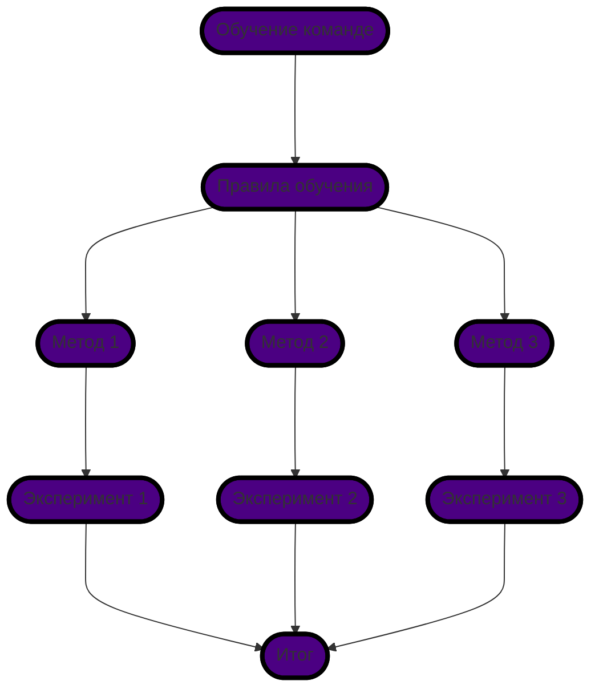

```mermaid
flowchart TD
    classDef class1 fill:#4B0082, stroke:#000, stroke-width:4px
    A([Обучение команде]):::class1
    B([Правила обучения]):::class1
    A--->B
    B--->C([Метод 1]):::class1 
    B--->D([Метод 2]):::class1
    B--->E([Метод 3]):::class1
    C--->F([Эксперимент 1]):::class1
    D--->I([Эксперимент 2]):::class1
    E--->R([Эксперимент 3]):::class1
    F--->N([Итог]):::class1
    I--->N([Итог]):::class1
    R--->N([Итог]):::class1
```
